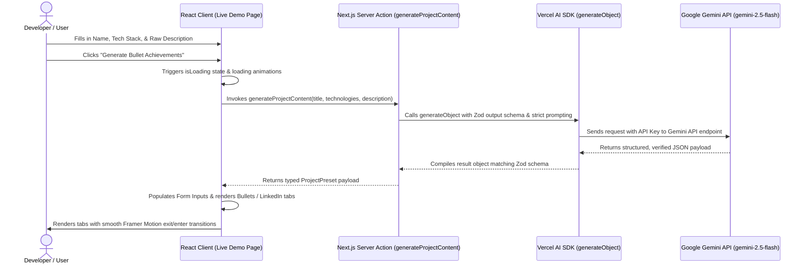

# BulletCraft 🚀
> Professional AI-Powered Resume Bullet & LinkedIn Post Generator

[](https://nextjs.org/)
[](https://sdk.vercel.ai/docs)
[](https://aistudio.google.com/)
[](https://tailwindcss.com/)
[](https://www.typescriptlang.org/)

**BulletCraft** is a premium, developer-focused tool designed to transform raw, casual project descriptions and drafts into high-impact, recruiter-ready, and ATS-optimized resume bullet points and professional LinkedIn announcements.

---

## 📖 Table of Contents
1. [Introduction & Purpose](#-introduction--purpose)
2. [What BulletCraft Does](#-what-bulletcraft-does)
3. [Architecture & Workflow](#-architecture--workflow)
4. [Tech Stack](#-tech-stack)
5. [Project Structure](#-project-structure)
6. [How It Works Under the Hood](#-how-it-works-under-the-hood)
7. [Installation & Setup](#-installation--setup)
8. [Design System & Aesthetics](#-design-system--aesthetics)
9. [Developer Info](#-developer-info)

---

## 📖 Introduction & Purpose

When searching for software engineering roles, your resume needs to stand out instantly. On average, recruiters scan a resume in **6 seconds**. To clear both automated Applicant Tracking Systems (ATS) and manual recruiter screens, achievement points cannot be simple lists of daily tasks; they must be structured as high-impact accomplishments.

**BulletCraft** bridges this gap using Google's **Gemini-2.5-Flash** API. It parses raw notes, cleans up technical descriptions, and structures output using the **STAR methodology** (Situation, Task, Action, Result). 

---

## 🎯 What BulletCraft Does

- 📝 **Structured Input Form:** Prompts users to define the project name, technologies integrated, and a raw draft description.
- 🎯 **ATS-Optimized Bullets:** Generates exactly three high-impact, professional resume bullet points that start with strong active verbs and feature quantified outcomes (e.g., performance improvements, scaling stats).
- 🔗 **LinkedIn Update Generator:** Drafts a polished, engaging social post presenting the project and its key technical milestones, pre-formatted with relevant hashtags.
- 📋 **Seamless Clipboard Copying:** Provides interactive client-side copy handlers with dynamic visual checkmark states.
- 📱 **Adaptive Visual Layout:** Fully responsive grid systems, dynamic loading animations, and smart icon-only collapses on mobile screens.

---

## 🏗️ Architecture & Workflow

The application relies on Next.js Server Actions and the Vercel AI SDK to stream typed JSON responses directly from the Gemini API.



---

## 🛠️ Tech Stack

### Frontend & Core
* **Framework:** Next.js 16.2.9 (utilizing App Router and the high-performance Turbopack compiler)
* **Language:** TypeScript 5.x (Strict type safety, custom path aliases)
* **Styling:** Tailwind CSS v4 (Sleek CSS imports, theme variables)
* **UI Components:** Built using custom elements styled with `@base-ui/react/button` primitives
* **Animations:** Framer Motion 12.x (Liquid tab transitions, loading pulsing effect, dynamic presence states)
* **Icons:** Lucide React

### Backend & AI Integrations
* **Runtime:** Node.js v18+ (also supports Bun runtime package setups)
* **AI Orchestrator:** Vercel AI SDK (`ai` library) for robust, declarative model calls
* **AI Provider:** `@ai-sdk/google` (configured for Google Gemini API integration)
* **AI Model:** `gemini-2.5-flash` (balanced for speed, text compression, and structured instructions)
* **Validation:** Zod (compiles response contracts dynamically to guarantee typescript safety)

---

## 📁 Project Structure

Below is an overview of the key directories and configuration files inside the `resume/` directory:

```bash
resume/
├── app/
│   ├── actions/
│   │   └── generation.ts        # Next.js Server Action connecting to Vercel AI SDK + Gemini
│   ├── components/
│   │   ├── BeforeAfter.tsx      # Landing page "Before vs After" comparisons
│   │   ├── Faq.tsx              # Dynamic, responsive FAQ dropdowns
│   │   ├── Features.tsx         # Card grids highlighting tool benefits
│   │   ├── FinalCta.tsx         # High-conversion end of page CTA routing to demo
│   │   ├── Footer.tsx           # Global contact, link directories, and copyright footer
│   │   ├── Hero.tsx             # Interactive landing hero featuring creator contact
│   │   ├── HowItWorks.tsx       # 3-step visualization illustrating the generator flow
│   │   ├── Navbar.tsx           # Responsive sticky header with blur effects and icon-only mobile collapse
│   │   ├── Testimonials.tsx     # Recruiter and developer endorsement section
│   │   └── Trust.tsx            # Highlight metrics (ATS success rates, scan speeds)
│   ├── demo/
│   │   └── page.tsx             # The Workspace Sandbox featuring input panel, tabs, and clipboard features
│   ├── favicon.ico              # Web tab icon
│   ├── globals.css              # Custom backgrounds (grid/dots), custom scrollbars, and Tailwind configuration
│   └── layout.tsx               # Root layout styling with Plus Jakarta Sans font integrations
├── components/
│   └── ui/
│       └── button.tsx           # Styled Shadcn UI Button component using @base-ui/react primitives
├── lib/
│   └── utils.ts                 # Style consolidation helper using clsx & tailwind-merge
├── public/
│   └── image.png                # Brand logo asset
├── components.json              # Shadcn components configuration
├── tsconfig.json                # TypeScript aliases and compile configuration
├── package.json                 # Core scripts, configurations, and packages
└── README.md                    # This documentation file
```

---

## ⚙️ How It Works Under the Hood

### Structured Schema Generation
When the developer clicks the generate button, the client runs `generateProjectContent` on the server. The Server Action calls the model with an explicit Zod output schema:

```typescript
const response = await generateObject({
  model: google("gemini-2.5-flash"),
  schema: z.object({
    title: z.string().describe("Professional project name based on inputs"),
    technologies: z.string().describe("Comma separated list of technologies used"),
    description: z.string().describe("Cleaned draft description"),
    bullets: z.array(z.string()).min(3).max(3).describe(
      "3 professional resume bullet points following STAR method with strong action verbs and quantified achievements"
    ),
    linkedin: z.string().describe("Engaging professional LinkedIn post update with bullet points and hashtags"),
  }),
  prompt: `...`
});
```

### Prompt Constraints (STAR Methodology)
The model is instructed to form achievements where each line:
1. Starts with a strong, active verb (e.g., *Architected*, *Optimized*, *Spearheaded*).
2. States the specific action taken (e.g., *Refactored database query loops*).
3. Demonstrates a clear, quantified outcome or metric (e.g., *resulting in a 40% reduction in API response times*).

---

## 🚀 Installation & Setup

Follow these steps to configure and run BulletCraft on your local machine:

### 1. Prerequisites
Ensure you have the following installed on your machine:
* **Node.js:** v18.0 or higher
* **Package Manager:** `npm` (packaged default) or `bun` / `pnpm`

### 2. Clone the Repository
```bash
git clone https://github.com/Himanshuazad03/BulletCraft.git
cd BulletCraft/resume
```

### 3. Install Dependencies
Install the required packages:
```bash
npm install
# or if using Bun
bun install
```

### 4. Configure Environment Variables
Create a file named `.env` in the root of the `resume/` directory and add your Google Gemini API key:
```env
GOOGLE_GENERATIVE_AI_API_KEY=your_google_gemini_api_key_here
```
> 💡 You can get a free Gemini API key by logging into [Google AI Studio](https://aistudio.google.com/).

### 5. Run the Project
Start the local development server with Next.js Turbopack compiler:
```bash
npm run dev
# or if using Bun
bun dev
```
Open [http://localhost:3000](http://localhost:3000) in your browser to view the application.

### 6. Build for Production
To compile and test a production-ready build:
```bash
npm run build
npm run start
```

---

## 🎨 Design System & Aesthetics

BulletCraft features a premium design system tailored to match high-end modern tools (similar to Linear or Vercel). Key aesthetic points include:

- **Typography:** Uses **Plus Jakarta Sans** via the Next.js Font Loader for a modern, crisp feel.
- **Micro-Animations:** Fluid layout and tab transitions powered by `framer-motion` to handle loading states and tab switches seamlessly.
- **Custom Background Patterns:** Designed with custom linear gradients, a subtle grid overlay (`bg-grid-pattern`), and standard dot-matrix overlays (`bg-dot-pattern`).
- **Responsive Navigation:** A sticky transparent navbar (`bg-white/80` with `backdrop-blur-md`) that collapses logo texts and text buttons into intuitive icons on small viewports to ensure perfect readability.
- **Scroll Optimization:** Customized modern slate-colored webkit scrollbars for a clean, cohesive scrolling experience.

---

## 🧑‍💻 Developer Info

* **Developer:** **Himanshu Azad**
* **Email:** [himanshuazad05@gmail.com](mailto:himanshuazad05@gmail.com)
* **Goal:** Building impact-driven, beautifully designed developer applications. Feel free to reach out for project collaboration!
